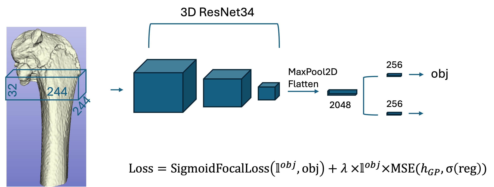

# Growth plate plane detection
3D Convolutional sliding window approach is used to detect growth plate plane in 3D micro CT images in rats.


# Installation

Needed libraries are listed in environment.yml

# Training and inference
Run 
```
source setup.sh
```
to setup python paths.
For training and inference run:
```
python scripts/train_3dwindow_CV.py --config configs/config_train.json
```

To run inference 
```
python scripts/run_inference.py --config configs/config_inference.json
```
Where pretrained 5-fold CV weights can be found in [box folder] (https://az.box.com/s/wnemaz3a9hm9nsgp1q9stxutg6q0f1or)

