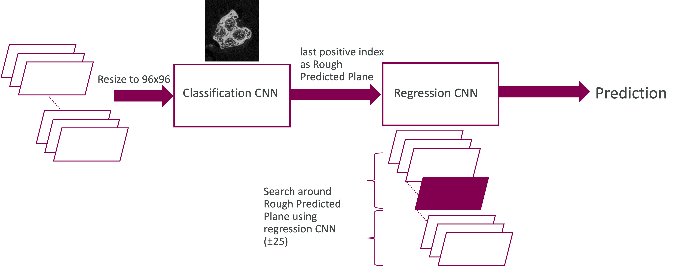
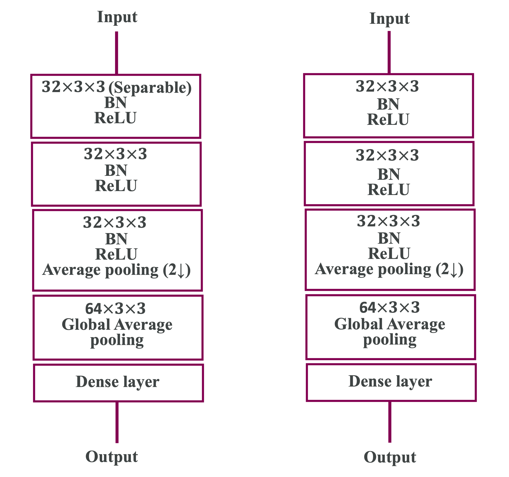

# Subvisible

# A parameter efficient solution for automatic growth plate detection in micro-CT mice bone scans

The solution is based on the observation that prior to reaching the Growth Plate Plane (GPP), a series of images in the axial plane present four distinct blobs, each corresponding to a protrusion. These blobs begin to merge upon reaching the GPP. We trained a binary classifier to identify images with these four blobs. This classifier identifies a series of images preceding the GPP as positive cases i.e. containing four blobs. The last index in this series serves as a rough estimate of the GPP. 

To refine these initial estimates, we leveraged information on the axial axis and performed a search around these points. For this purpose, we employed a regression CNN. We examined 25 slices before and after the initial rough estimates, resulting in a stack of 51 images. This stack was fed into the model, the aim of which was to generate refined predictions of the GPP. 

Figure [1](#figure-1) shows the overall diagram of our proposed approach. Considering the limited amount of training data, we trained two lightweight CNN networks for both the classification and regression tasks. Each network as shown in Figure [2](#figure-2) has only four levels of convolution layers and less than 40K parameters in total. These lightweight networks, along with resizing the images to 96×96 before feeding them to the models, make the training process quite fast. The loss function for the classification network is cross-entropy loss, and the negative of the score function is used as the loss function for the regression network.

### Figure 1

  

### Figure 2

  

## Installation
pip install -r requirements.txt
